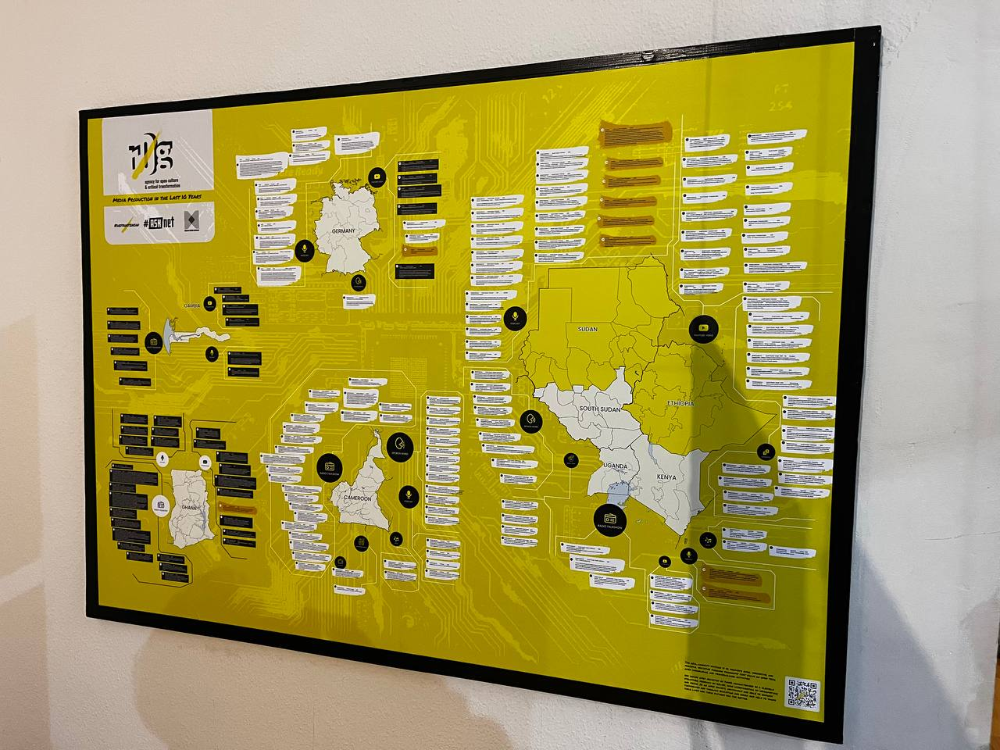
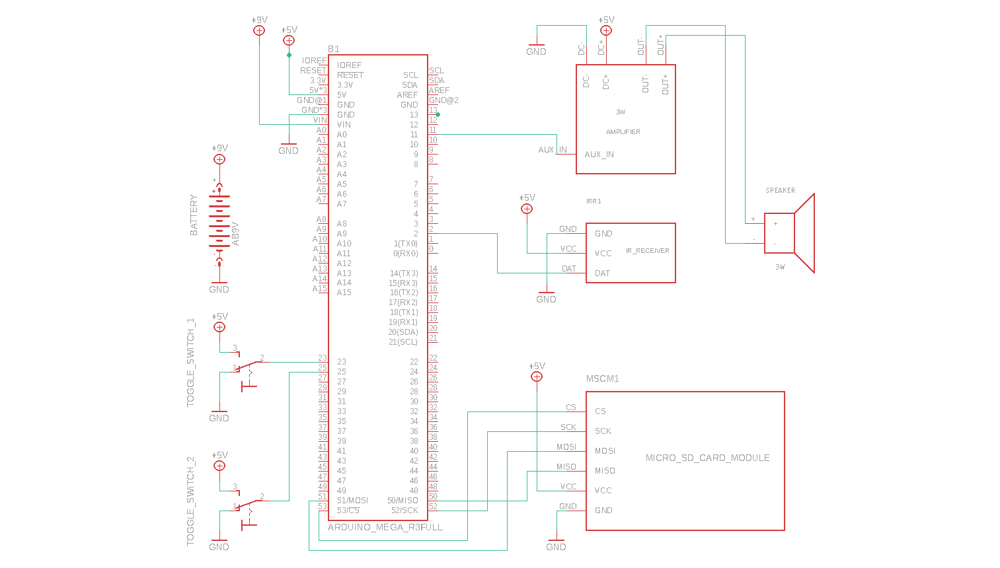

# Interactive Media-Wall
A media art installation based on Arduino that visualizes r0g Agency's media
productions in seven countries from 2013 to 2023. 

The interactive wall map displays projects like:
*• Migrant Media Network - #MMN (The Gambia, Ghana, Germany)
*• #defyhatenow (Cameroon, South Sudan, Kenya)
*• Access to Skills & Knowledge network - #ASKnet (South Sudan, Uganda, Kenya)

The installation is an immersive environment in which to explore a variety of
content, including radio talk shows, podcasts, music, spoken word performances,
jingles, and interviews.

The media wall can be controlled by the users through remote control or toggle
switches mounted on the installation itself. It is possible to listen to specific media
productions directly by switching a toggle switch. The installation can be operated
fully offline, with only a power supply connection.

For instance, you can groove to '#ThinkB4UClick' Spoken Word by Mac Alunge produced
by #defyhatenow Cameroon 2021, or listen to the LetsTalk Podcast with Yine
Yenki from GoGirls ICT by #defyhatenow South Sudan 2018. You can also listen to a
radio talk show on Dela Radio in the Volta Region, Ghana, as #MMN Local
Coordinator James Javerence talks on "Positive Alternatives at Home" in 2022. You
can also hear Bashir Jay on the #ASKNet South Sudan Podcast, where he talks about the
role of media in community transformation in 2023 and beyond.

As a highlight of the r0g @ 10 years celebration in 2023, this interactive media
wall demonstrates the power of open-source technology and thoughtful design in
illustrating a decade of transformative media impact on communities.

## Table of Contents

- [Technical Documentation](#technical-documentation)
  - [Tools](#tools)
  - [Components](#components)
    - [Software](#software)
    - [Hardware](#hardware)
  - [Schematic](#schematic)
  - [Preparing Audio Files](#preparing-audio-files)
  - [Assembly](#assembly)



## Technical Documentation

### Tools

- A computer/laptop that can support an arduino IDE
- Micro SD card adapter
- Electrician's pliers
- Wire stripper
- Screwdriver
- [Soldering kit](https://docs.arduino.cc/learn/electronics/soldering-basics)

### Components

#### Software

- Arduino Integrated Development Environment(IDE)
- [IRremote](https://www.arduino.cc/reference/en/libraries/irremote/)
- [TMRpcm](https://www.arduino.cc/reference/en/libraries/tmrpcm/)
- [SD](https://www.arduino.cc/reference/en/libraries/sd/)

#### Hardware

- [Arduino Mega 2560](https://store.arduino.cc/products/arduino-mega-2560-rev3)
- Speaker - >=4 Ω <= 8 Ω, >=3 W. Make sure that the amplifier can support the speaker so the speaker's wattage should not go above the maximum support value for the amplifier.
- Amplifier. You can buy an amplifier module like this [one](https://www.amazon.com/HiLetgo-TDA2822M-1-8-12V-Channel-Amplifier/dp/B07XBKTNKF/ref=sr_1_4?keywords=arduino+amplifier&qid=1702563658&sr=8-4) or build your own amplifier using this [guide](https://docs.arduino.cc/tutorials/generic/simple-audio-player). If you decide to build an amplifier, you'll need:
  - LM386 (low power audio amplifier)
  - 10k Ω potentiometer
  - 10 Ω resistor
  - 2 x 10 µF capacitor
  - 0.05 µF or 0.1 µF capacitor
  - 250 µF capacitor
- [3 pin Toggle switches](https://www.amazon.com/MTS-203-Position-Toggle-Switch-Quality/dp/B0799HC3VY/ref=sr_1_15?crid=2VO2H1Q5I1XZU&keywords=toggle%2Bswitch%2B3%2Bposition&qid=1702563968&sprefix=toggle%2Bswitch%2B3%2Bpos%2Caps%2C335&sr=8-15&th=1). Toggle switches are optional. You only need them if you want to control specific audio files using a switch. You can have as many as 48 as long as you update the code to support them. Alternatively, you can control the audio files using the IR Remote.
- [Micro SD Card module](https://store.nerokas.co.ke/index.php?route=product/product&product_id=1082)
- Micro SD Card
- Connecting wire
- [IR Receiver](https://www.amazon.com/Digital-Receiver-Transmitter-Electronic-Building/dp/B08X2MFS6S/ref=sr_1_16?keywords=ir+receiver&qid=1702563456&sr=8-16)
- [IR Remote](https://www.aliexpress.com/item/4000683769904.html)
- Power supply adapter 7-12V, 1A such as [this one](https://store.nerokas.co.ke/index.php?route=product/product&product_id=84)

### Schematic



### Preparing Audio Files

- Arduino cannot read complex audio files directly. Use this [website](https://audio.online-convert.com/convert-to-wav) to convert the audio files.. They have to be converted to `WAV` files with the following configuration:

  - Samples Per second (Hz): **16000**
  - Channel: **Mono**
  - Bits Per Sample: **8PCM**
  - format: PCM unsigned **8-bit**

- Format your Micro SD using the FAT file system
- Rename the audio files in sequential order as `001.wav, 002.wav --> 999.wav`. Update your code with the name of the last audio file.

```cpp
void loop() {
  if (dataCount == keyLength - 1) {
    int songNumber = atoi(song);
    if (songNumber > 192 /* Change this number */) {
      Serial.println("Sorry, there is no song with that name");
    } else {
      Serial.println(song);
      player.play(song);
    }
    dataCount = 0;
  }
}
```

- Copy the audio files to the root of the Micro SD card

### Assembly

- Connect the Micro SD Card module


  - *MISO* to pin 50
  - *MOSI* to pin 51
  - *SCK* to pin 52
  - *CS* to pin 53
  - *VCC* pin provides power to the module and should be connected to the Arduino’s 5V pin
  - *GND* is a ground pin

- Connect the IR Receiver

  - *DAT* to pin 2
  - *VCC* pin provides power to the module and should be connected to the Arduino’s 5V pin
  - *GND* is a ground pin
- Connect the Amplifier to the arduino board and the speaker

  - *AUX Input* to pin 2
  - *DC+* to VCC
  - *DC-* to GND
  - *OUT+* to aux cable which connects to speaker
  - *OUT-* to aux cable which connects to speaker
- Connect the toggle switches.

  - Connect the *center pin* to one of the available digital input pins on the board - You can connect to pins 0,1,3-10,12-49.
  - Connect one pin to *GND* and the other to *VCC*
- Update the code to support the toggle switches
  - List the specific audio files that you want to play/pause using toggle switches

  ```cpp
  /*
   * Song list
   */
  char song1[] = "001.wav";
  char song2[] = "002.wav";
  ```

  - Configure button pins

  ```cpp
  // buttons
  #define debounce 10
  const int button1 = 22; // pin
  const int button2 = 24;
  ```

  - Initialize the button state for all your buttons as `LOW`

  ```cpp
  // button states
  bool button1State = LOW;
  bool button2State = LOW;
  ```

  - Configure all your buttons as `INPUT_PULLUP`

  ```cpp
  // Setting up buttons as input
  pinMode(button1, INPUT_PULLUP);
  pinMode(button2, INPUT_PULLUP);
  ```

  - Read the initial state of all your buttons

  ```cpp
  // read button states
  bool button1Value = !(digitalRead(button1));
  bool button2Value = !(digitalRead(button2));
  ```

  - Set up each button to play a specific song

  ```cpp
  // Here button1 is connected to song 1
  if (button1Value != button1State) {
    button1State = !button1State;
    if (button1State == HIGH) {
      if (currentSong == 1) {
        player.pause();
      } else {
        currentSong = 1;
        player.play(song1);
      }
    } else {
      Serial.println("button 1 OFF");
      if (currentSong == 1) {
        player.pause();
      }
    }
  }
  ```

- Update the code to support your IR Remote. IR remotes are unique since each key maps to a specific code. The codes vary from one remote to another so you have to map the keys for your remote. To identify the key codes:
  - Update the `void irCallbackHandler();` function to print the codes

  ```cpp
  void irCallbackHandler() {
    if (IrReceiver.decode()) {
        irData = IrReceiver.decodedIRData.decodedRawData;
        Serial.println(IrReceiver.decodedIRData.decodedRawData);
    }
  }
  ```

  - While running the program, open the `Serial Monitor` and press a key. Copy the code and update the `String resolveIRKey(uint32_t data);` function. Do the same for all the keys in the function.

  ```cpp
  String resolveIRKey(uint32_t data) {
    switch (data) {
        case 3910598400: // Paste the code to replace 3910598400
            return "0"; // Press 0 on your remote and copy the code printed on the Serial monitor
        default:
            return "Q";
    }
  }
  ```

- Upload the code to the board. Once the IR remote keys and the toggle switches have been configured, update the final copy of the code to the arduino board. Use the remote or toggle switches to see if your audio files are being played.
- [Power the board using an external adapter or other alternatives](https://docs.arduino.cc/learn/electronics/power-pins)
